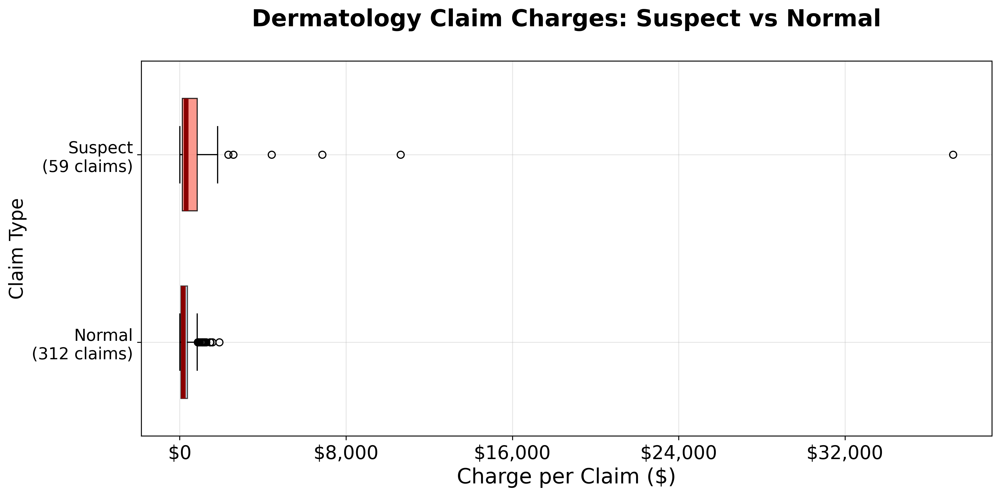

# Dermatology Upcoding Analysis
**Python 3.10.0** | Fraud detection for self-funded employers

[](linkedin_upcoding_boxplot.png)

**TPA flags dermatology upcoding. Providers claim "no difference" (p=0.0725). The boxplot tells a different story.**

## LinkedIn Post
```
👨‍💼 Scenario: You're a self-funded employer.
🚨 TPA flags dermatology upcoding.
😒 Center claims: "t-test shows no difference (p=0.0725)."

[BOXPLOT IMAGE]

What now? See the following analysis for details in this hypothetical scenario, and the counterpunch that wins the stats argument and empowers you to push back.

📄 Full analysis: https://raw.githubusercontent.com/dglassbrenner1/medical-upcoding-save-tens-of-thousands-per-yr/main/how-a-self-funded-employer-could-save-tens-of-thousands-per-yr.html
🔗 GitHub code: https://github.com/dglassbrenner1/medical-upcoding-save-tens-of-thousands-per-yr

#DataScience #HealthcareAnalytics #FraudDetection #Statistics
```

## Quick Start
```bash
git clone https://github.com/dglassbrenner1/medical-upcoding-save-tens-of-thousands-per-yr
cd medical-upcoding-save-tens-of-thousands-per-yr

python3.10 -m venv env
source env/bin/activate  # Linux/Mac
# env\Scripts\activate    # Windows

pip install -r requirements.txt
jupyter notebook provider-level-test-provides-evidence-of-fraudulent-upcoding.ipynb
```

## Key Products
- **Technical analysis**: `provider-level-test-provides-evidence-of-fraudulent-upcoding.ipynb` (raw code)
- **Employer report**: `how-a-self-funded-employer-could-save-tens-of-thousands-per-yr.html` (polished explanations)  
- **LinkedIn graphic**: `linkedin_upcoding_boxplot.png` (static PNG)

## Why p=0.0725 Fails
- **Clustering**: Claims are clustered within providers.
- **Wrong unit of analysis**: Providers are the correct unit of analysis, not claims.

## Structure
```
├── README.md
├── requirements.txt
├── provider-level-test-provides-evidence-of-fraudulent-upcoding.ipynb
├── how-a-self-funded-employer-could-save-tens-of-thousands-per-yr.html
├── linkedin_upcoding_boxplot.png
└── data/
    └── synthetic_claims.csv
```

**Complete reproducible analysis for TPA upcoding investigations.**